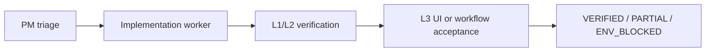
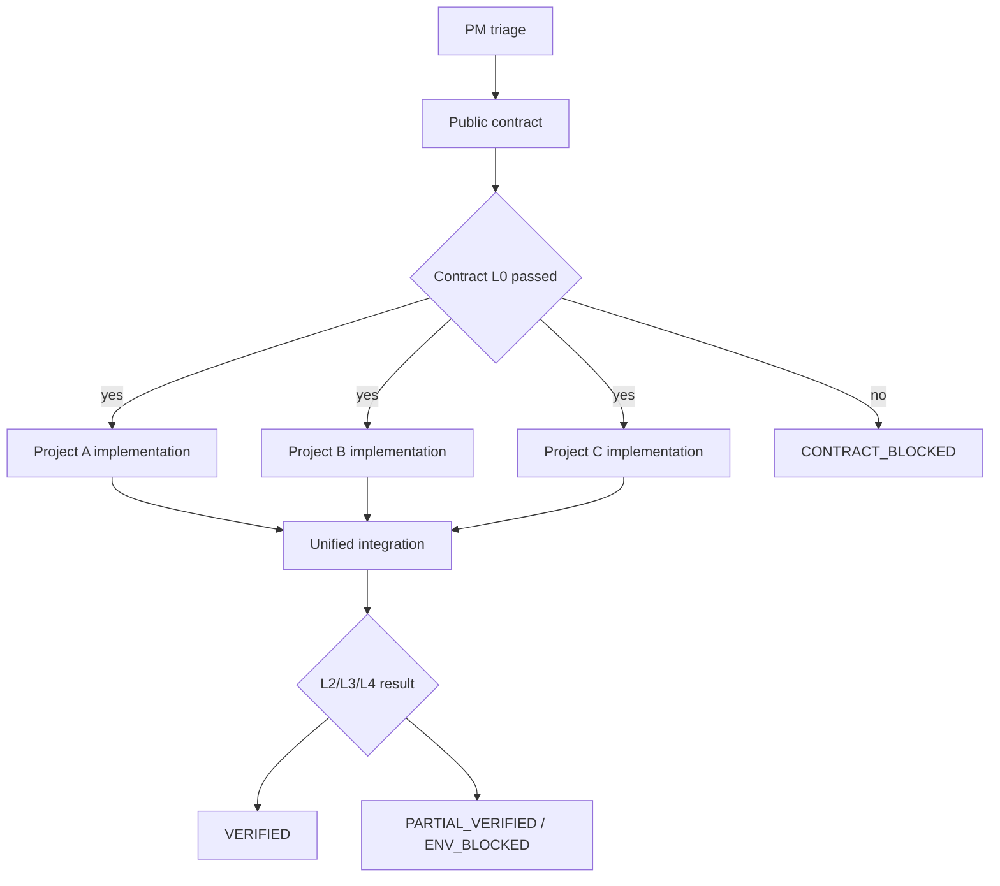
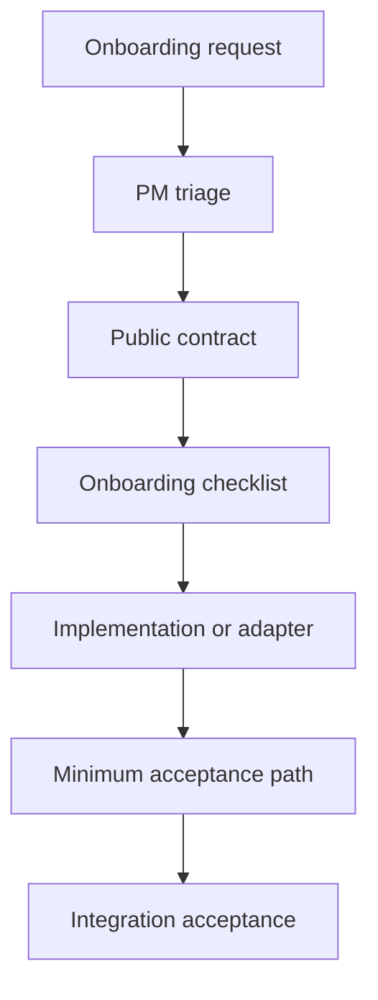
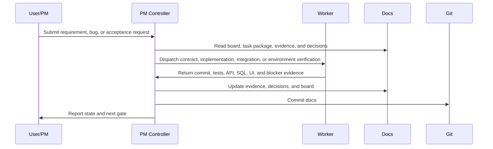

# PM Dispatch Development Skill

English documentation. Default Chinese README: [README.md](README.md)

This repository contains a reusable Codex skill for PM-led software delivery. It uses one controller thread to maintain a task board, dispatch requirements, bugs, integration checks, acceptance work, and release-readiness reviews to focused workers, then collects evidence and advances explicit delivery gates.

It is designed for:

- single-project delivery,
- multi-project integration,
- new-project onboarding,
- AI-assisted engineering projects,
- unstable real environments,
- and teams that need durable verification evidence instead of verbal "done" claims.

## I. Usage Guide

### 1. When To Use This Skill

Use this skill for:

- **New requirements**: write the spec, scope, acceptance criteria, and decide whether contract work is needed.
- **New bugs**: deduplicate, classify, capture reproduction and evidence, then decide whether to fix now.
- **Continuing active work**: pick the highest-priority unblocked task from the board.
- **Dispatching work**: create contract, implementation, integration, or environment-verification workers.
- **Closing worker threads**: collect commit, test, API, SQL, UI, log, and blocker evidence.
- **Regression planning**: choose L0-L4 checks based on the actual blast radius.
- **Blocker triage**: separate code issues, contract ambiguity, environment blockers, and PM decisions.
- **Daily task boards**: show what can be done today, what is blocked, and what needs PM judgment.
- **Release readiness**: review unresolved P0/P1 items, L4 failures, environment blockers, and accepted risks.

For a tiny one-file change, you probably do not need the full PM dispatch workflow. Implement, test, and commit directly.

### 2. Installation

Copy this skill directory into your Codex skills folder:

```bash
mkdir -p ~/.codex/skills
cp -R pm-dispatch-development ~/.codex/skills/
```

Validate the skill:

```bash
python3 ~/.codex/skills/.system/skill-creator/scripts/quick_validate.py ~/.codex/skills/pm-dispatch-development
```

Expected output:

```text
Skill is valid!
```

### 3. Basic Codex Prompts

Use the skill explicitly:

```text
Use $pm-dispatch-development to triage this request, update the task board, dispatch implementation or acceptance work, and collect evidence for the next PM gate.
```

Common prompts:

```text
Show me today's task board.
```

```text
Continue the highest-priority unblocked item.
```

```text
New bug:
Title:
Observed behavior:
Reproduction steps:
Expected behavior:
Actual behavior:
Priority: P0
Fix now: yes
```

```text
New requirement:
Background:
Goal:
Affected projects:
Acceptance criteria:
```

```text
Dispatch BUG-001.
```

```text
Dispatch BUG-001 only. Do not start automatic monitoring.
```

```text
Read the worker results and update the board.
```

```text
Prepare integration acceptance.
```

```text
Prepare release-readiness acceptance.
```

```text
Accept BUG-001 verification.
```

### 4. Three Ways To Start

#### 4.1 You Do Not Have A Project Yet

Use this when you only have an idea, a product direction, or a requirement, but no code repository yet. Do not ask Codex to immediately generate a large codebase. First create the PM workspace and the first spec.

Recommended flow:

1. Create an empty repository or directory.
2. Initialize the `docs/` dispatch workspace.
3. Create `SPEC-001` with goals, boundaries, acceptance criteria, and open technical choices.
4. Ask the PM to confirm the plan.
5. Dispatch a project-skeleton implementation worker only after PM confirmation.
6. After the skeleton is verified, continue using single-project or multi-project mode.

Prompt:

```text
Use $pm-dispatch-development to start a new project from scratch.
Project goal:
Users:
Core features:
Preferred stack:
For now, only create the PM dispatch docs and SPEC-001. Do not write business code yet.
```

If you already want to create a code skeleton:

```text
Use $pm-dispatch-development to start a new project from scratch.
First create SPEC-001 and the task board. After PM confirmation, dispatch a project-skeleton implementation worker.
```

Why this helps: it creates order around tasks, evidence, decisions, and acceptance before AI starts generating code.

#### 4.2 You Already Have An Existing Project

Use this when you already have a repository and want to introduce PM dispatch into it. The first step is not refactoring. The first step is a read-only scan and documentation setup.

Recommended flow:

1. Enable the skill at the project root.
2. Ask Codex to read the existing README, startup scripts, test commands, directory structure, and CI config.
3. Create `docs/dispatch-board.md`, `docs/dispatcher-runbook.md`, `docs/regression-guard.md`, and `docs/tasks/`.
4. Record startup commands, test commands, key modules, and known risks.
5. Start with the first real bug or spec.

Prompt:

```text
Use $pm-dispatch-development to onboard this existing project.
First read the code structure, startup commands, test commands, and existing docs.
Create PM dispatch docs, a task board, and regression guards.
Do not modify business code.
```

After onboarding:

```text
Use $pm-dispatch-development to add a new bug: ...
```

```text
Use $pm-dispatch-development to add a new requirement: ...
```

```text
Show me today's task board.
```

Why this helps: it adds a task board, evidence gates, and verification levels without changing the existing code organization.

#### 4.3 You Already Have One AI-Built Project And Want To Onboard Another AI Project

Use this when one AI-built or AI-maintained project already exists and you want another AI-built project to integrate with it. Do not let two AI projects modify each other directly. Start with contract and onboarding work.

Recommended flow:

1. Treat the existing AI project as the current system.
2. Treat the new AI project as the system being onboarded.
3. Create an onboarding task such as `SPEC-002` or `ONBOARD-001`.
4. Dispatch a contract worker to define inputs, outputs, APIs, events, files, configuration, authentication, error handling, and regression scope.
5. If the new AI project does not exist yet, dispatch a project-skeleton worker.
6. If the new AI project already has code, dispatch an integration-adapter worker.
7. Use an integration worker to verify the real cross-project flow.

Prompt:

```text
Use $pm-dispatch-development to onboard a new AI project B into existing AI project A.
Enter new-project onboarding mode:
1. Read project A's README, startup commands, APIs, and test commands.
2. Create an onboarding task and public contract for project B.
3. Define A/B inputs, outputs, auth, config, error handling, and integration acceptance.
4. Do not modify business code in either project until PM confirms the contract.
```

If the new AI project does not exist yet:

```text
Use $pm-dispatch-development to onboard a new AI project that does not exist yet.
Write the spec and public contract first, then dispatch a project-skeleton worker, then run cross-project integration.
```

If the new AI project already has code:

```text
Use $pm-dispatch-development to onboard an existing new AI project.
First do a read-only scan of both projects, create the onboarding task, contract, and integration acceptance checklist. Do not modify business code.
```

Why this helps: it turns AI-generated projects into verifiable, rollback-friendly, integration-ready systems instead of loosely connected codebases.

### 5. Operating Modes

#### 5.1 Single-Project Mode

Use this when one repository, one service, or one UI surface can complete the work.

Prompt:

```text
Use $pm-dispatch-development in single-project mode for this bug. Only dispatch one implementation worker and one L3 acceptance worker.
```

Best for:

- one-page UI improvements,
- one-service API bugs,
- one-module performance work,
- config, script, or documentation fixes within one repository.

Flow:



#### 5.2 Multi-Project Integration Mode

Use this when multiple repositories, services, pages, databases, or external environments must work together. Contract work should happen before implementation.

Prompt:

```text
Use $pm-dispatch-development in multi-project integration mode.
Start with a public contract, then dispatch frontend and backend implementation workers, then run unified integration acceptance.
```

Best for:

- frontend -> backend -> database flows,
- service A -> service B -> result-page flows,
- upload -> processing -> query -> page-display flows,
- requirements that need commits in multiple repositories.

Flow:



Multi-project evidence must record:

- repository, branch, and commit for each project,
- startup command, port, PID, and log path for each service,
- cross-project APIs, fields, state transitions, and user-visible behavior,
- data source, marked as `real` or `mock-based`,
- API/curl, SQL, Browser, and key IDs,
- unresolved real-environment blockers.

#### 5.3 New-Project Onboarding Mode

Use this when a new system, service, module, or external project must join an existing system.

Prompt:

```text
Use $pm-dispatch-development to onboard a new project.
Create the onboarding task, public contract, implementation task, and integration acceptance task.
```

The onboarding checklist must define:

- repository URL, branch, and owner,
- startup command, port, health check, and log path,
- configuration, secrets, database, and external dependencies,
- input/output contracts and error handling,
- minimum L0/L1/L2/L3 acceptance gates.

Flow:



### 6. New Requirement Intake

PM input:

```text
New requirement:
I want XXX.
Background: XXX is currently inconvenient.
Expected behavior: after users enter A/B/C, the system should complete XXX.
Affected projects: frontend + backend. API changes are unclear.
```

Controller-thread behavior:

1. Create or update the requirement/spec document.
2. Extract project memory from the board, bug tracker, and regression guide.
3. Clarify goal, current behavior, scope, API, UI, data, failure cases, and acceptance criteria.
4. Keep draft stage documentation-only.
5. Output open PM questions.

PM confirmation:

```text
Confirm the spec. Continue splitting workers.
```

### 7. New Bug Intake

Minimal PM input:

```text
New bug:
Title: one sentence.
Observed behavior:
Reproduction:
Expected behavior:
Actual behavior:
Priority: P0 / P1 / P2.
Fix now: register only / fix immediately / wait for my confirmation.
```

Controller-thread behavior:

1. Read the bug tracker or existing task directories.
2. Search for duplicate or similar issues.
3. Attach to an existing task if appropriate.
4. Otherwise create a standard task.
5. Output suspected cause, impact, suggested workers, regression level, and whether docs should be updated.

Only write docs or dispatch fixes after explicit PM confirmation.

### 8. Continue Active Work

Prompt:

```text
Continue the highest-priority unblocked item.
```

Controller-thread behavior:

1. Read `docs/dispatch-board.md`.
2. Skip `ENV_BLOCKED`, `PM_BLOCKED`, `VERIFIED`, and archived items.
3. Select the highest-priority actionable task.
4. Decide whether the next step is contract, implementation, integration, or PM decision.
5. Report the recommendation and required PM confirmation.

### 9. Dispatch Work

Prompt:

```text
Dispatch BUG-001.
```

Default meaning:

- `Dispatch BUG-XXX` means dispatch and monitor until closure.
- Say `dispatch only, do not start automatic monitoring` if you only want a worker created.

Controller-thread behavior:

1. Read `docs/tasks/<TASK_ID>/task.yaml`.
2. Read the matching prompt, for example `docs/tasks/<TASK_ID>/prompts/02-implementation.md`.
3. Create or assign the worker.
4. Write the worker ID back to the task package and board.
5. Commit the dispatch record in docs.
6. Start monitoring by default.

Every worker prompt must include:

- role and repository boundary,
- current objective and hard failure,
- relevant public contract sections,
- previous fixes and unverified items,
- search keywords, classes, endpoints, tables, or file paths,
- forbidden actions,
- regression level,
- evidence table,
- serial or parallel dependency rules.

### 10. Close Worker Results

Prompt or automated heartbeat:

```text
Read the worker results and update the board.
```

Controller-thread behavior:

1. Read worker status.
2. Extract the evidence table.
3. Decide whether evidence is complete.
4. Update `docs/tasks/<TASK_ID>/evidence.md`.
5. Update `docs/dispatch-board.md`.
6. Update the bug tracker or regression docs if needed.
7. Commit docs.
8. If another serial worker is required, move to the next gate.
9. If terminal state is reached, stop monitoring.

Worker evidence must include:

```text
Acceptance evidence:
- git status:
- commit hash:
- commit message:
- changed files:
- test commands and results:
- curl / API request summary:
- SQL query and result summary:
- Browser / UI verification summary:
- service startup command:
- service port / PID:
- log path:
- failed items / BLOCKED reason:
```

If evidence is incomplete, do not mark `VERIFIED`. Create a repair prompt or mark the blocker.

### 11. Regression Levels

Choose regression based on the blast radius:

- `L0`: docs, prompts, contract notes, static grep.
- `L1`: single-project build, unit tests, component tests.
- `L2`: API, SQL, service logic.
- `L3`: UI, buttons, interactions, frontend state.
- `L4`: real end-to-end flow.

Example:

```text
BUG-001:
Backend repair worker runs L1 + L2.
Integration worker runs L4.
Frontend does not need to start unless API fields or UI behavior changed.
```

### 12. Handle Blockers

If the blocker comes from network, real logs, database, account, permissions, disk, external service, or deployment environment, use:

```text
ENV_BLOCKED
```

Example:

```text
Code status: FIXED
Verification status: L2+L3_VERIFIED
Blocker: ENV_BLOCKED
Reason: real environment account is unavailable, so end-to-end verification cannot run.
Need PM: provide accessible environment, or accept delayed real L4.
```

PM decision examples:

```text
Accept the code fix now. Delay real L4 verification.
```

```text
I will provide new environment config. Rerun integration.
```

Mocks, fixtures, and unit tests can prove code branches. They must not be presented as real L4.

### 13. Daily Board

Prompt:

```text
Show me today's task board.
```

Suggested output:

```text
Ready for development:
- BUG-001: backend repair worker

Needs integration:
- BUG-002

Environment blocked:
- BUG-003

Needs PM acceptance:
- SPEC-001
```

The PM should not need to read long documents to know the current queue and decisions.

### 14. Release Readiness

Prompt:

```text
Prepare release-readiness acceptance.
```

Controller-thread behavior:

1. Read the regression guide.
2. Summarize all unresolved P0/P1 items.
3. Decide which tasks require L4.
4. Create integration or release-readiness workers.
5. Check default config, ports, auth, upload, query, and key user paths.
6. Output release risks.

Do not ignore before release:

- unresolved P0 items,
- cross-project contract changes,
- hard L4 failures,
- `ENV_BLOCKED` items that PM has not accepted for delay.

### 15. Initialize Project Docs

Run at the target project root:

```bash
mkdir -p docs/tasks
touch docs/dispatch-board.md
touch docs/dispatcher-runbook.md
touch docs/integration-bug-tracker.md
touch docs/regression-guard.md
```

Create a starter board:

```bash
cat > docs/dispatch-board.md <<'EOF'
# Dispatch Board

## Active

| ID | Priority | Status | Evidence | Owner | Next |
| --- | --- | --- | --- | --- | --- |

## Blocked

| ID | Priority | Status | Evidence | Blocker | Next |
| --- | --- | --- | --- | --- | --- |

## Verified / Archive

| ID | Priority | Status | Evidence | Closed At | Notes |
| --- | --- | --- | --- | --- | --- |
EOF
```

Commit initialization docs:

```bash
git status --short
git add docs/dispatch-board.md docs/dispatcher-runbook.md docs/integration-bug-tracker.md docs/regression-guard.md
git commit -m "docs: initialize PM dispatch workflow"
```

### 16. Create A Task Directory

```bash
TASK=BUG-001
mkdir -p "docs/tasks/${TASK}/prompts"
cat > "docs/tasks/${TASK}/task.yaml" <<EOF
id: ${TASK}
title: TBD
priority: P0
status: TRIAGED
evidence_level: NONE
owner: PM
area: []
mode: single-project
threads:
  contract: null
  implementation: null
  integration: null
blockers: []
last_updated: $(date +%F)
EOF

cat > "docs/tasks/${TASK}/evidence.md" <<EOF
# Evidence

## $(date +%F) PM triage

- Request:
- Scope:
- Acceptance:
- Blockers:
EOF

cat > "docs/tasks/${TASK}/decisions.md" <<EOF
# Decisions

## $(date +%F) PM decision

- Decision:
- Reason:
- Accepted fallback:
- Forbidden actions:
- Next:
EOF
```

Commit the task skeleton:

```bash
git add "docs/tasks/${TASK}" docs/dispatch-board.md
git commit -m "docs: add ${TASK} dispatch task"
```

### 17. Recommended Daily Rhythm

Start the day:

```text
Show me today's task board.
```

Pick work:

```text
Continue the highest-priority unblocked item.
```

Dispatch:

```text
Dispatch BUG-XXX.
```

Close:

```text
Read the worker results and update the board.
```

Accept:

```text
Accept BUG-XXX verification.
```

Before release:

```text
Prepare release-readiness acceptance.
```

## II. Operating Principles

### 1. Mental Model

PM dispatch development treats Codex as a controller thread. Implementation, contract design, integration, and environment verification are separate workers. The controller should maintain the durable source of truth before asking workers to change code.



### 2. Why Gates Exist

Complex projects usually fail because:

- ownership boundaries are unclear,
- API fields or data semantics are unclear,
- implementation is complete but integration conditions are missing,
- unit tests pass but UI or end-to-end verification fails,
- environment failures are mixed with code failures.

Gates separate these concerns:

```text
TRIAGED -> CONTRACT -> READY_FOR_IMPL -> IN_IMPL -> READY_FOR_INTEGRATION -> IN_INTEGRATION -> terminal state
```

Terminal states:

- `VERIFIED`
- `L*_VERIFIED_MOCK`
- `PARTIAL_VERIFIED`
- `ENV_BLOCKED`
- `CONTRACT_BLOCKED`
- `THREAD_BLOCKED`
- `PM_BLOCKED`

### 3. Evidence Levels

| Level | Meaning | Typical Evidence |
| --- | --- | --- |
| L0 | Static checks, documentation checks, contract checks | grep, schema, doc diff |
| L1 | Single-project build, tests, component checks | test, build, lint |
| L2 | Service-level verification | API, curl, SQL, logs |
| L3 | User-workflow verification | Browser, UI, buttons, interaction |
| L4 | Real end-to-end flow | real services, real data, or PM-approved complete fallback |
| L*_VERIFIED_MOCK | PM-approved mock fallback | must be marked `mock-based` |

Do not mix evidence level with task conclusion. For example:

```text
PARTIAL_VERIFIED / L2_VERIFIED
```

means the API passed, but UI or real environment verification is still blocked.

### 4. Documentation Layout

Recommended structure:

```text
docs/
|-- dispatch-board.md
|-- dispatcher-runbook.md
|-- integration-bug-tracker.md
|-- regression-guard.md
`-- tasks/
    `-- BUG-001/
        |-- task.yaml
        |-- evidence.md
        |-- decisions.md
        `-- prompts/
            |-- 01-contract.md
            |-- 02-implementation.md
            `-- 03-integration.md
```

Responsibilities:

- `dispatch-board.md`: queue, state, owner, and next step.
- `dispatcher-runbook.md`: controller-thread operating rules.
- `task.yaml`: task metadata, worker IDs, status, and blockers.
- `evidence.md`: durable evidence log.
- `decisions.md`: PM decisions and accepted fallbacks.
- `prompts/*.md`: reusable worker prompts.
- `integration-bug-tracker.md`: cross-task issues and project memory.
- `regression-guard.md`: regression levels and acceptance requirements.

### 5. Worker Prompt Design

Every worker prompt should make the following explicit:

- who the worker is,
- which task it owns,
- what it may edit,
- what it must not edit,
- what context it must read,
- what evidence it must return,
- when it must stop,
- how to classify `VERIFIED`, `BLOCKED`, or repair-needed outcomes.

Implementation worker template:

```markdown
You are handling <TASK-ID> implementation.

Goal:
- Implement the smallest PM-approved change that can be verified.

Allowed scope:
- You may modify <repo/files>.
- Do not modify <forbidden repos/files>.

Required return:
- git status
- commit hash
- changed files
- root cause and implementation summary
- test commands and results
- API/curl/SQL/Browser evidence
- failed items or blockers

Stop conditions:
- If forbidden repositories must be modified, mark CONTRACT_BLOCKED.
- If environment, DB, token, service process, or disk blocks verification, mark ENV_BLOCKED.
```

Integration worker template:

```markdown
You are handling <TASK-ID> integration acceptance.

Goal:
- Prefer real-environment verification for the user-visible behavior and regression items.

Allowed scope:
- Start services, prepare test data, run API/SQL/Browser verification.
- Do not modify business code unless PM explicitly authorizes repair.

Required return:
- git status
- service startup method
- port / PID / log path
- test data source, marked real or mock-based
- curl/API/SQL/Browser evidence
- key IDs such as requestId, jobId, traceId, recordId
- L2/L3/L4 or blocker conclusion
- failed items and ownership judgment
```

### 6. Monitoring Heartbeat

The heartbeat rule is simple: do not disturb running workers, and never lose completed evidence.

Template:

```markdown
Continue <TASK-ID> automatic dispatch monitoring.
First read docs/dispatch-board.md, docs/dispatcher-runbook.md,
docs/tasks/<TASK-ID>/task.yaml, docs/tasks/<TASK-ID>/evidence.md,
docs/tasks/<TASK-ID>/decisions.md, and the current prompt.

Read latest worker thread <THREAD-ID> status.
If the worker is still running, only provide a short status update and do not edit docs.
If the worker is complete, extract commit/files/tests/API/SQL/Browser/evidence/blockers,
update task evidence, task status, board, and bug tracker, then commit docs.
```

### 7. Board Design

The board is an action queue, not a report. It should answer:

- What can be done now?
- What is blocked?
- What needs PM judgment?

Recommended structure:

```markdown
# Dispatch Board

## Active

| ID | Priority | Status | Evidence | Owner | Next |
| --- | --- | --- | --- | --- | --- |

## Blocked

| ID | Priority | Status | Evidence | Blocker | Next |
| --- | --- | --- | --- | --- | --- |

## Verified / Archive

| ID | Priority | Status | Evidence | Closed At | Notes |
| --- | --- | --- | --- | --- | --- |
```

### 8. Mock Fallback Rules

Mocks are allowed only if:

1. PM explicitly accepts mock fallback.
2. Evidence is marked `mock-based`.
3. Mock evidence is not presented as real L4.

Recommended wording:

```text
L3_VERIFIED_MOCK: Browser workflow passed with generated test data.
Risk: production data was not verified.
PM decision: accept mock evidence for this round; real L4 is delayed.
```

### 9. Commit Rules

Keep documentation commits separate from product-code commits when possible.

Commit PM docs only:

```bash
git status --short
git add docs/dispatch-board.md docs/dispatcher-runbook.md docs/integration-bug-tracker.md docs/regression-guard.md docs/tasks
git commit -m "docs: update PM dispatch board"
```

Inspect the latest docs commit:

```bash
git show --stat --oneline --name-only HEAD
```

### 10. Migration Checklist

1. Install this skill.
2. Use this README to initialize project docs.
3. Define the three operating modes: single-project, multi-project integration, and new-project onboarding.
4. Define worker types: Codex thread, sub-agent, CI job, or human executor.
5. Agree on evidence levels and mock fallback rules.
6. Start with the first real P0 bug or cross-system spec.
7. Clean the board daily and archive terminal tasks.
8. Once stable, write a project-specific `dispatcher-runbook.md`.
