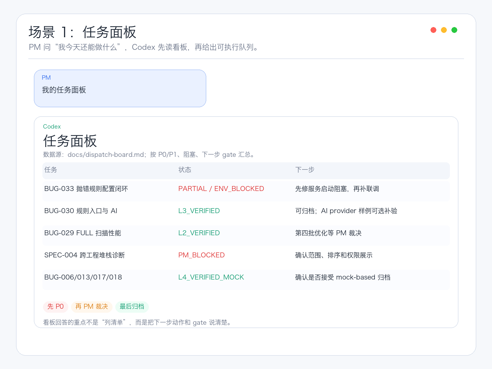
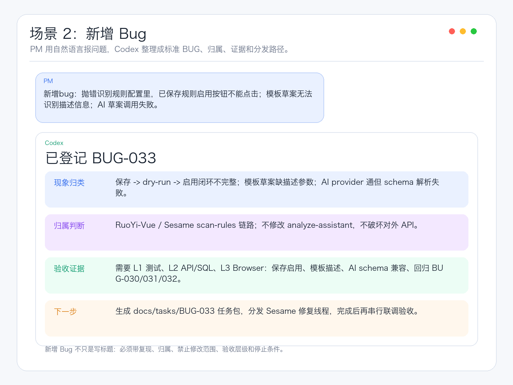
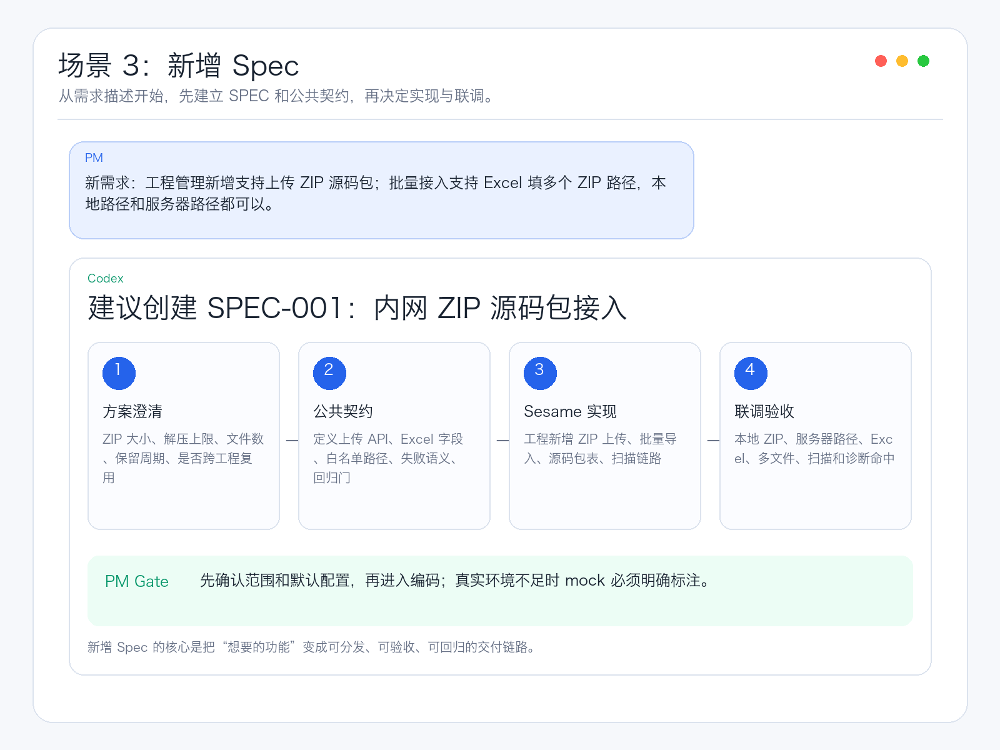
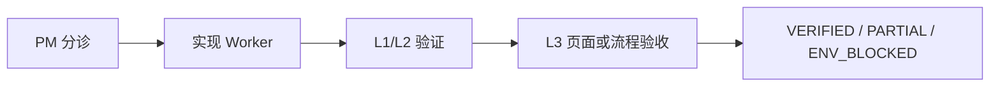
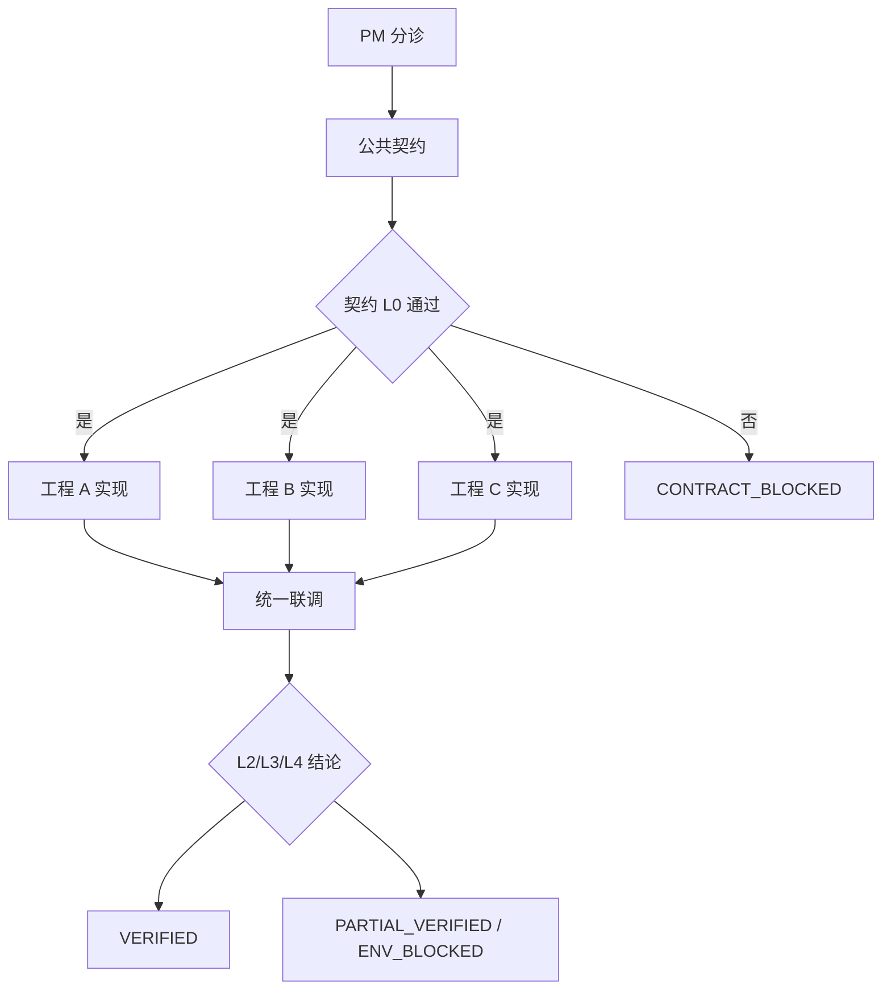
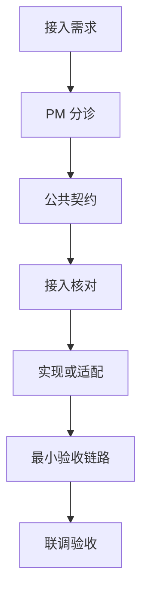
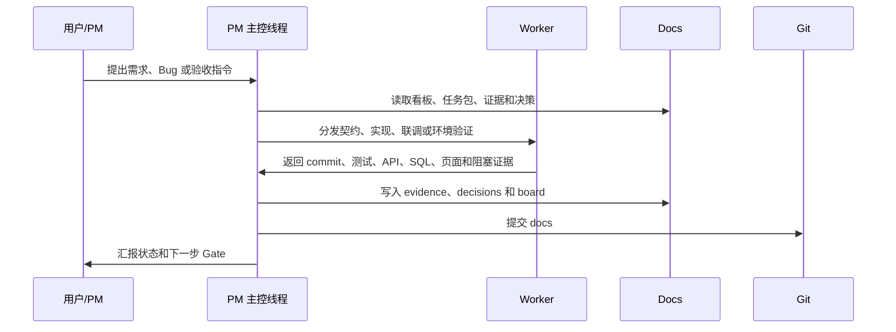

# PM 调度式开发 Skill

默认中文文档。English version: [README.en.md](README.en.md)

这是一套给 PM 和工程负责人使用的 Codex 工作流：用一个主控线程维护任务看板，把需求、Bug、联调、验收和发布前检查分发给实现或验收 Worker，再回收证据并推进 Gate。

它适合单工程交付、多工程联调、新工程接入、环境条件不稳定、验收证据必须留痕的项目。

## 一、使用说明

### 1. 适用场景

使用这个 skill 处理以下工作：

- 新需求进入：先写清 spec、范围、验收标准，再决定是否拆公共契约和实现线程。
- 新 Bug 进入：先查重、归类、补充复现和证据，再决定是否立即修复。
- 继续未完成项：从看板里选最高优先级、未阻塞、可推进的任务。
- 任务分发：创建契约、实现、联调或环境验收 Worker。
- 线程收口：读取 Worker 结果，提取 commit、测试、API、SQL、页面和阻塞证据。
- 回归验收：按 L0-L4 分层选择必要回归，不做无意义全量测试。
- 阻塞裁决：区分代码问题、契约问题、环境问题和 PM 决策问题。
- 每日看板：输出今天能做什么、卡在哪里、哪些需要 PM 决策。
- 发布前验收：检查未关闭 P0/P1、L4 失败、环境阻塞和未接受风险。

小型单文件修改可以直接实现，不必套完整 PM 调度流程。

### 2. 安装方式

把本目录放到 Codex skill 目录：

```bash
mkdir -p ~/.codex/skills
cp -R pm-dispatch-development ~/.codex/skills/
```

校验 skill：

```bash
python3 ~/.codex/skills/.system/skill-creator/scripts/quick_validate.py ~/.codex/skills/pm-dispatch-development
```

期望输出：

```text
Skill is valid!
```

### 3. 基础调用命令

在 Codex 中可以直接这样说：

```text
使用 $pm-dispatch-development 分诊这个需求，更新任务看板，分发实现或验收工作，并回收证据推进下一道 PM gate。
```

常用命令：

```text
给我今天的任务看板。
```



上图展示了看板类问题的典型回答：Codex 先读取 `docs/dispatch-board.md`，再按优先级、阻塞状态和下一步 gate 输出可执行队列。

```text
继续处理当前优先级最高的未完成项。
```

```text
新增 bug：
标题：
现象：
复现步骤：
期望结果：
实际结果：
优先级：P0
是否现在修：立即修复
```



上图展示了新增 Bug 的处理方式：自然语言问题会被整理为标准 BUG、归属边界、验收证据和后续分发路径。

```text
新需求：
背景：
目标：
涉及工程：
验收标准：
```



上图展示了新增 Spec 的处理方式：先澄清范围和公共契约，再进入实现和联调验收，避免需求直接变成无边界编码。

```text
分发 BUG-001。
```

```text
只分发 BUG-001，不开启自动调度。
```

```text
读取各线程结果并更新看板。
```

```text
准备联调验收。
```

```text
准备打包前验收。
```

```text
接受 BUG-001 验收。
```

### 4. 三种起步方式

#### 4.1 还没有新建工程

这种情况适合“只有想法、需求或产品方向，还没有代码仓库”。先不要急着让 Codex 直接写一堆代码，先用本 skill 建立项目的 PM 工作区和第一个 Spec。

推荐做法：

1. 创建一个空仓库或空目录。
2. 初始化 `docs/` 调度文档。
3. 写第一个 `SPEC-001`，明确目标、边界、验收和技术选型问题。
4. PM 确认方案后，再分发“工程骨架实现 Worker”。
5. 工程骨架完成后，再按单工程或多工程模式继续推进功能。

可以直接对 Codex 说：

```text
使用 $pm-dispatch-development 从零启动一个新项目。
项目目标：
用户：
核心功能：
期望技术栈：
先只建立 PM 调度文档和 SPEC-001，不要直接写业务代码。
```

如果你已经确定要直接创建代码骨架，可以说：

```text
使用 $pm-dispatch-development 从零启动一个新项目，先创建 SPEC-001 和任务看板；PM 确认后再分发工程骨架实现 Worker。
```

此时本 skill 的价值是：先建立“任务、证据、决策、验收”的秩序，再让 AI 写代码，避免一开始就进入无边界生成。

#### 4.2 已经有现有工程

这种情况适合“已有代码仓库，现在想把 PM 调度式开发接进去”。第一步不是重构代码，而是让 Codex 只读扫描工程，建立任务看板、回归守卫和工程记忆。

推荐做法：

1. 在工程根目录安装或启用本 skill。
2. 让 Codex 读取现有 README、启动脚本、测试命令、目录结构和 CI 配置。
3. 创建 `docs/dispatch-board.md`、`docs/dispatcher-runbook.md`、`docs/regression-guard.md` 和 `docs/tasks/`。
4. 记录现有工程的启动方式、测试方式、关键模块和已知风险。
5. 从第一个真实 Bug 或 Spec 开始试运行。

可以直接对 Codex 说：

```text
使用 $pm-dispatch-development 接入这个现有工程。
先只读取代码结构、启动方式、测试命令和已有文档，
建立 PM 调度文档、任务看板和回归守卫，
不要修改业务代码。
```

接入完成后，日常使用：

```text
使用 $pm-dispatch-development 新增 bug：...
```

```text
使用 $pm-dispatch-development 新需求：...
```

```text
给我今天的任务看板。
```

此时本 skill 的价值是：给已有工程补上“看板、证据、Gate 和验收分层”，不改变原有代码组织。

#### 4.3 已经有一个 AI 开发工程，还要接入新的 AI 工程

这种情况适合“已有一个用 AI 开发或维护的工程，现在要让另一个 AI 工程接入它”。不要直接让两个工程互相改代码，先按“新工程接入模式”做公共契约和接入核对。

推荐做法：

1. 把已有 AI 工程当作“既有系统”。
2. 把新 AI 工程当作“待接入系统”。
3. 先创建接入任务，例如 `SPEC-002` 或 `ONBOARD-001`。
4. 公共契约 Worker 先明确输入输出、API、事件、文件、配置、鉴权、错误处理和回归范围。
5. 如果新 AI 工程还不存在，先分发“新工程骨架 Worker”。
6. 如果新 AI 工程已经存在，先分发“接入适配 Worker”。
7. 最后用联调 Worker 验证两个工程之间的真实链路。

可以直接对 Codex 说：

```text
使用 $pm-dispatch-development 在已有 AI 工程 A 的基础上接入新的 AI 工程 B。
先进入新工程接入模式：
1. 读取工程 A 的 README、启动方式、接口和测试命令；
2. 为工程 B 创建接入任务和公共契约；
3. 明确 A/B 的输入输出、鉴权、配置、错误处理和联调验收；
4. 不要直接改两个工程的业务代码，等 PM 确认契约后再分发实现。
```

如果新 AI 工程还没创建：

```text
使用 $pm-dispatch-development 接入一个尚未创建的新 AI 工程。
先写 SPEC 和公共契约，再分发工程骨架实现 Worker，最后做跨工程联调。
```

如果新 AI 工程已经有代码：

```text
使用 $pm-dispatch-development 接入已有的新 AI 工程。
先只读扫描两个工程，建立接入任务、契约和联调验收清单，不要修改业务代码。
```

此时本 skill 的价值是：把“AI 写出来的工程”纳入可验证、可回滚、可联调的交付系统，而不是让多个 AI 工程靠口头约定拼接。

### 5. 三种运行模式

#### 5.1 单工程模式

一个仓库、一个服务或一个页面可以闭环时使用。公共契约可选，通常只需要实现 Worker 和验收 Worker。

```text
使用 $pm-dispatch-development 以单工程模式处理这个 bug，只需要实现和 L3 验收。
```

适合：

- 单页面 UI 优化。
- 单服务接口 Bug。
- 单模块性能优化。
- 单仓库配置、脚本或文档修复。

流程：



#### 5.2 多工程联调模式

多个仓库、服务、页面、数据库或外部环境共同交付时使用。公共契约应作为前置 Gate，各工程实现完成后由联调 Worker 统一验收。

```text
使用 $pm-dispatch-development 以多工程联调模式处理这个需求，先做公共契约，再分别分发前端和后端实现，最后统一联调验收。
```

适合：

- 前端 -> 后端 -> 数据库链路。
- 服务 A -> 服务 B -> 结果页面展示。
- 上传 -> 处理 -> 查询 -> 页面展示。
- 一个需求需要多个仓库分别提交 commit。

流程：



多工程联调必须记录：

- 每个工程的仓库、分支、commit。
- 每个服务的启动命令、端口、PID、日志路径。
- 跨工程 API、字段、状态机和页面行为。
- 测试数据来源，标注 real 或 mock-based。
- API/curl、SQL、Browser、关键 ID。
- 是否有真实环境阻塞。

#### 5.3 新工程接入模式

新系统、新服务、新模块或外部工程要接入现有体系时使用。它比多工程联调多一个“接入核对”动作。

```text
使用 $pm-dispatch-development 接入一个新工程，创建接入任务、契约任务、实现任务和联调验收任务。
```

接入核对必须明确：

- 仓库地址、分支、owner。
- 启动命令、端口、健康检查、日志路径。
- 配置、密钥、数据库和外部依赖。
- 输入输出契约和错误处理方式。
- 最小 L0/L1/L2/L3 验收门槛。

流程：



### 6. 新需求进入

PM 输入：

```text
新需求：
希望 XXX。
背景：现在 XXX 不方便。
期望：用户输入 A/B/C 后，系统完成 XXX。
涉及前端 + 后端，接口是否要改不确定。
```

Codex 主控线程应执行：

1. 新建或更新需求说明文档。
2. 从看板、Bug 总账、回归指南中提取工程记忆。
3. 写清目标、现状、范围、接口、页面、数据、失败场景和验收标准。
4. 明确 Draft 阶段只写文档，不改代码。
5. 输出需要 PM 确认的问题。

PM 确认后再进入契约或实现：

```text
确认 spec，继续拆线程。
```

### 7. 新 Bug 进入

PM 最小输入：

```text
新增 bug：
标题：一句话说明问题。
现象：我看到 XXX 不符合预期。
复现：打开 XXX 页面，输入 XXX，点击 XXX，出现 XXX。
期望：应该 XXX。
优先级：P0 / P1 / P2。
是否现在修：先登记 / 立即修复 / 等我确认后再修。
```

Codex 主控线程应执行：

1. 读取 Bug 总账或现有任务目录。
2. 搜索是否已有相同或相近问题。
3. 如果属于已有任务，建议挂接到已有条目。
4. 如果是新问题，整理为标准任务。
5. 输出根因初判、影响范围、建议 Worker、回归层级和是否写入文档。

只有 PM 明确确认后，才进入文档落盘或修复分发。

### 8. 继续处理未完成项

PM 输入：

```text
继续处理当前优先级最高的未完成项。
```

Codex 主控线程应执行：

1. 读取 `docs/dispatch-board.md`。
2. 跳过 `ENV_BLOCKED`、`PM_BLOCKED`、`VERIFIED` 或已归档项。
3. 选择最高优先级且可执行的任务。
4. 判断下一步是公共契约、实现、联调还是 PM 裁决。
5. 输出建议和需要 PM 确认的问题。

### 9. 任务分发

PM 输入：

```text
分发 BUG-001。
```

默认语义：

- `分发 BUG-XXX` = 分发并自动调度到收口。
- 如果只想创建线程、不自动追踪，需要明确说“只分发，不开启自动调度”。

Codex 主控线程应执行：

1. 读取 `docs/tasks/<TASK_ID>/task.yaml`。
2. 读取对应 prompt，例如 `docs/tasks/<TASK_ID>/prompts/02-implementation.md`。
3. 创建或指派 Worker。
4. 回写 worker ID 到任务包和看板。
5. 提交 docs 中的调度记录。
6. 默认开启 heartbeat 或巡检。

Worker prompt 必须包含：

- 线程身份和仓库边界。
- 本轮目标和当前硬失败。
- 相关公共契约章节。
- 已有修复记录和未验证项。
- 优先检索关键词、类名、接口、表名或文件路径。
- 禁止事项。
- 回归层级。
- 验收证据表。
- 串并行关系。

### 10. Worker 完成后收口

PM 输入或 heartbeat 自动触发：

```text
读取各线程结果并更新看板。
```

Codex 主控线程应执行：

1. 读取 Worker 状态。
2. 提取证据表。
3. 判断证据是否完整。
4. 更新 `docs/tasks/<TASK_ID>/evidence.md`。
5. 更新 `docs/dispatch-board.md`。
6. 必要时更新 Bug 总账或回归文档。
7. 提交 docs。
8. 如果还有下一串行 Worker，自动进入下一 Gate。
9. 如果达到终态，暂停或删除巡检。

Worker 必须返回：

```text
验收证据：
- git status：
- commit hash：
- commit message：
- 修改文件：
- 测试命令与结果：
- curl / 接口请求摘要：
- SQL 查询与结果摘要：
- Browser / 页面验证摘要：
- 服务启动命令：
- 服务端口 / PID：
- 日志位置：
- 未通过项 / BLOCKED 原因：
```

证据不足时，不能推进到 `VERIFIED`，应生成返修 prompt 或标记阻塞。

### 11. 回归按需执行

按变更面选择回归层级：

- `L0`：纯文档、prompt、契约说明、静态 grep。
- `L1`：单工程构建、单测、组件测试。
- `L2`：接口、SQL、服务逻辑。
- `L3`：页面、按钮、交互、前端状态。
- `L4`：真实端到端链路。

示例：

```text
BUG-001：
后端修复线程执行 L1 + L2。
联调线程执行 L4。
前端无需启动，除非接口字段或页面交互变化。
```

### 12. 遇到阻塞

如果阻塞来自网络、真实日志、数据库、账号、权限、磁盘、外部服务或部署环境，标记：

```text
ENV_BLOCKED
```

示例：

```text
代码状态：FIXED
验证状态：L2+L3_VERIFIED
阻塞状态：ENV_BLOCKED
原因：真实环境账号不可用，无法完成端到端链路。
需要 PM：提供可访问环境，或接受真实 L4 延期。
```

PM 可裁决：

```text
先接受代码修复，L4 真实环境延期。
```

或：

```text
我提供新的环境配置，重新联调。
```

mock、fixture、单测只能证明代码分支，不能冒充真实 L4。

### 13. 每日看板

PM 输入：

```text
给我今天的任务看板。
```

Codex 输出建议格式：

```text
立即开发：
- BUG-001：后端修复线程

待联调补验：
- BUG-002

环境阻塞：
- BUG-003

待 PM 验收：
- SPEC-001
```

PM 不需要阅读长文档，只看当前队列和需要裁决的问题。

### 14. 发布前验收

PM 输入：

```text
准备打包前验收。
```

Codex 主控线程应执行：

1. 读取回归指南。
2. 汇总所有未关闭 P0/P1。
3. 判断哪些任务必须 L4。
4. 创建联调或打包前验收 Worker。
5. 检查默认配置、端口、鉴权、上传、查询和关键用户路径。
6. 输出发布风险清单。

发布前不能忽略：

- P0 未关闭项。
- 跨工程公共契约变化。
- L4 硬失败。
- `ENV_BLOCKED` 但未被 PM 接受延期的项。

### 15. 初始化项目文档

在目标项目根目录执行：

```bash
mkdir -p docs/tasks
touch docs/dispatch-board.md
touch docs/dispatcher-runbook.md
touch docs/integration-bug-tracker.md
touch docs/regression-guard.md
```

写入基础看板：

```bash
cat > docs/dispatch-board.md <<'EOF'
# Dispatch Board

## Active

| ID | Priority | Status | Evidence | Owner | Next |
| --- | --- | --- | --- | --- | --- |

## Blocked

| ID | Priority | Status | Evidence | Blocker | Next |
| --- | --- | --- | --- | --- | --- |

## Verified / Archive

| ID | Priority | Status | Evidence | Closed At | Notes |
| --- | --- | --- | --- | --- | --- |
EOF
```

提交初始化文档：

```bash
git status --short
git add docs/dispatch-board.md docs/dispatcher-runbook.md docs/integration-bug-tracker.md docs/regression-guard.md
git commit -m "docs: initialize PM dispatch workflow"
```

### 16. 创建一个任务目录

```bash
TASK=BUG-001
mkdir -p "docs/tasks/${TASK}/prompts"
cat > "docs/tasks/${TASK}/task.yaml" <<EOF
id: ${TASK}
title: 待填写
priority: P0
status: TRIAGED
evidence_level: NONE
owner: PM
area: []
mode: single-project
threads:
  contract: null
  implementation: null
  integration: null
blockers: []
last_updated: $(date +%F)
EOF

cat > "docs/tasks/${TASK}/evidence.md" <<EOF
# Evidence

## $(date +%F) PM 分诊

- 需求：
- 范围：
- 验收：
- 阻塞：
EOF

cat > "docs/tasks/${TASK}/decisions.md" <<EOF
# Decisions

## $(date +%F) PM 决策

- 决策：
- 原因：
- 接受的 fallback：
- 禁止事项：
- 后续：
EOF
```

提交任务骨架：

```bash
git add "docs/tasks/${TASK}" docs/dispatch-board.md
git commit -m "docs: add ${TASK} dispatch task"
```

### 17. 推荐日常节奏

每天开始：

```text
给我今天的任务看板。
```

选任务：

```text
继续处理当前优先级最高的未完成项。
```

分发：

```text
分发 BUG-XXX。
```

收口：

```text
读取各线程结果并更新看板。
```

验收：

```text
接受 BUG-XXX 验收。
```

发布前：

```text
准备打包前验收。
```

## 二、原理说明

### 1. 总体模型

PM 调度式开发把 Codex 当作“主控线程”，把实现、契约、联调、环境验证当作可分发的 Worker。主控线程不急着改代码，而是先维护事实源，再把边界清晰的工作交给合适 Worker。



### 2. 为什么要分 Gate

复杂项目的问题通常不是“会不会写代码”，而是：

- 谁拥有修复边界不清。
- 接口字段和数据语义不清。
- 实现完成但联调条件不满足。
- 单测通过但页面或端到端失败。
- 环境问题和代码问题混在一起。

Gate 的作用是把这些问题拆开：

```text
TRIAGED -> CONTRACT -> READY_FOR_IMPL -> IN_IMPL -> READY_FOR_INTEGRATION -> IN_INTEGRATION -> 终态
```

终态包括：

- `VERIFIED`
- `L*_VERIFIED_MOCK`
- `PARTIAL_VERIFIED`
- `ENV_BLOCKED`
- `CONTRACT_BLOCKED`
- `THREAD_BLOCKED`
- `PM_BLOCKED`

### 3. 证据等级

| 等级 | 含义 | 常见证据 |
| --- | --- | --- |
| L0 | 静态检查、文档核对、契约检查 | grep、schema、文档 diff |
| L1 | 单工程构建、单测、组件测试 | test、build、lint |
| L2 | 服务级验证 | API、curl、SQL、日志 |
| L3 | 用户工作流验证 | Browser、页面、按钮、交互 |
| L4 | 真实端到端链路 | 真实服务、真实数据或 PM 接受的完整替代链路 |
| L*_VERIFIED_MOCK | PM 接受的 mock fallback | 必须标注 mock-based |

证据等级和任务结论不要混用。例如：

```text
PARTIAL_VERIFIED / L2_VERIFIED
```

表示接口通过，但页面或真实环境仍阻塞。

### 4. 任务目录原理

推荐目录：

```text
docs/
├── dispatch-board.md
├── dispatcher-runbook.md
├── integration-bug-tracker.md
├── regression-guard.md
└── tasks/
    └── BUG-001/
        ├── task.yaml
        ├── evidence.md
        ├── decisions.md
        └── prompts/
            ├── 01-contract.md
            ├── 02-implementation.md
            └── 03-integration.md
```

职责：

- `dispatch-board.md`：当前队列、状态、owner 和下一步。
- `dispatcher-runbook.md`：主控线程执行规则。
- `task.yaml`：单任务元数据、线程 ID、状态和阻塞。
- `evidence.md`：持久证据日志。
- `decisions.md`：PM 决策和接受的 fallback。
- `prompts/*.md`：可复用 Worker prompt。
- `integration-bug-tracker.md`：跨任务缺陷和工程记忆。
- `regression-guard.md`：回归层级和验收要求。

### 5. Worker Prompt 原理

每个 Worker prompt 都要让 Worker 明确：

- 你是谁。
- 要处理哪个任务。
- 可以改什么，不能改什么。
- 必读哪些上下文。
- 必须返回哪些证据。
- 什么情况下必须停止。
- 如何判断 VERIFIED、BLOCKED 或返修。

实现 Worker 模板：

```markdown
你正在处理 <TASK-ID> 实现。

目标：
- 按 PM 已确认方案实现最小可验收改动。

允许范围：
- 可以修改 <repo/files>。
- 不要修改 <forbidden repos/files>。

必须返回：
- git status
- commit hash
- 修改文件
- 根因和实现摘要
- 测试命令与结果
- API/curl/SQL/Browser 证据
- 未通过项或阻塞项

停止条件：
- 如果必须越界修改禁止仓库，标记 CONTRACT_BLOCKED。
- 如果环境、DB、token、服务进程或磁盘阻塞，标记 ENV_BLOCKED。
```

联调 Worker 模板：

```markdown
你正在处理 <TASK-ID> 联调验收。

目标：
- 用真实环境优先验证本任务的用户可见行为和回归项。

允许范围：
- 启动服务、准备测试数据、执行 API/SQL/Browser 验收。
- 不修改业务代码，除非 PM 明确授权返修。

必须返回：
- git status
- 服务启动方式
- 端口 / PID / 日志路径
- 测试数据来源，注明 real 或 mock-based
- curl/API/SQL/Browser 证据
- 关键 ID，如 requestId、jobId、traceId、recordId
- L2/L3/L4 或阻塞结论
- 未通过项和归属判断
```

### 6. 巡检原理

巡检 heartbeat 的核心是“不打扰正在运行的 Worker，不丢失已完成的证据”。

模板：

```markdown
继续 <TASK-ID> 自动调度巡检。
先读取 docs/dispatch-board.md、docs/dispatcher-runbook.md、
docs/tasks/<TASK-ID>/task.yaml、docs/tasks/<TASK-ID>/evidence.md、
docs/tasks/<TASK-ID>/decisions.md 和当前 prompt。

读取 worker 线程 <THREAD-ID> 最新状态。
如果线程仍在运行，只简短更新状态，不改文档。
如果线程完成，提取 commit/files/tests/API/SQL/Browser/evidence/blockers，
更新任务证据、任务状态、看板和 bug tracker，并提交 docs。
```

### 7. 看板原理

看板不是日报，而是行动队列。它应该回答三个问题：

- 现在能做什么？
- 什么被阻塞？
- 什么需要 PM 裁决？

推荐结构：

```markdown
# Dispatch Board

## Active

| ID | Priority | Status | Evidence | Owner | Next |
| --- | --- | --- | --- | --- | --- |

## Blocked

| ID | Priority | Status | Evidence | Blocker | Next |
| --- | --- | --- | --- | --- | --- |

## Verified / Archive

| ID | Priority | Status | Evidence | Closed At | Notes |
| --- | --- | --- | --- | --- | --- |
```

### 8. Mock fallback 原理

mock 可以用，但要遵守三条规则：

1. PM 明确接受 mock fallback。
2. 证据必须标注 `mock-based`。
3. mock 不能冒充真实 L4。

推荐写法：

```text
L3_VERIFIED_MOCK：Browser 工作流使用生成测试数据通过。
风险：真实生产数据未验证。
PM 决策：接受 mock 证据作为本轮验收，真实 L4 延后。
```

### 9. 提交原则

文档提交和产品代码提交尽量分开。

只提交 PM 文档：

```bash
git status --short
git add docs/dispatch-board.md docs/dispatcher-runbook.md docs/integration-bug-tracker.md docs/regression-guard.md docs/tasks
git commit -m "docs: update PM dispatch board"
```

查看最近一次文档提交：

```bash
git show --stat --oneline --name-only HEAD
```

### 10. 迁移到其它项目

1. 安装本 skill。
2. 复制或参考本 README 初始化目标项目 docs。
3. 定义三种运行模式：单工程、多工程联调、新工程接入。
4. 定义 worker 类型：Codex 线程、子智能体、CI job 或人工执行者。
5. 约定证据等级和 mock fallback 规则。
6. 从第一个 P0 Bug 或跨系统 Spec 开始试运行。
7. 每天清理看板，终态任务归档。
8. 稳定后再沉淀项目专属 `dispatcher-runbook.md`。
